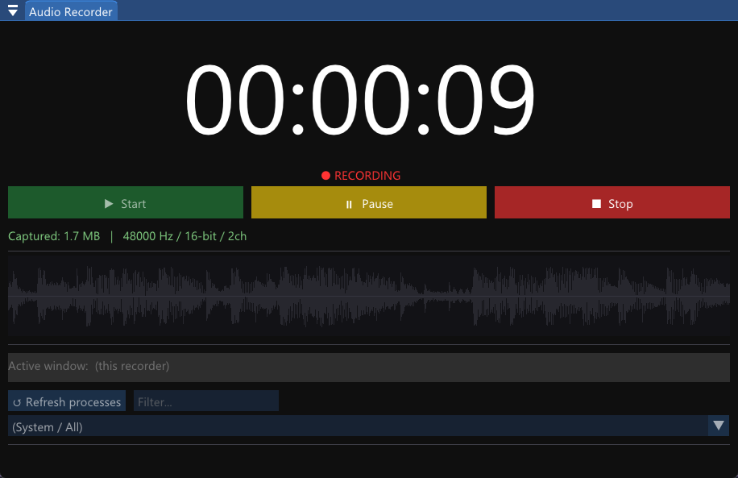
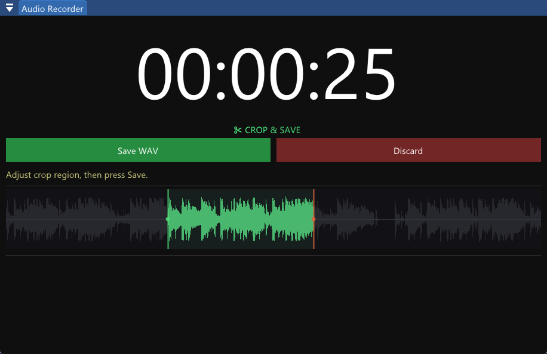

## Audio Loopback Recorder

* Per process playback audio recording.
    * Choose either system wide recording or pick the active process or choose from a list
* Custom DearImGui waveform editing widget.
* Crop and export recording in WAV format

  

  

